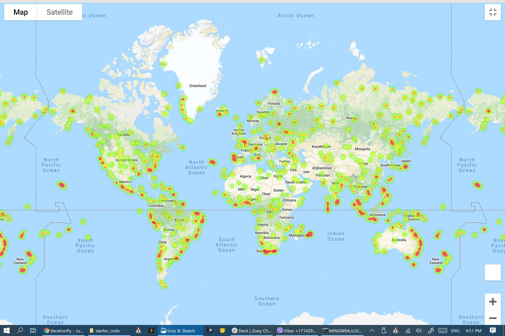
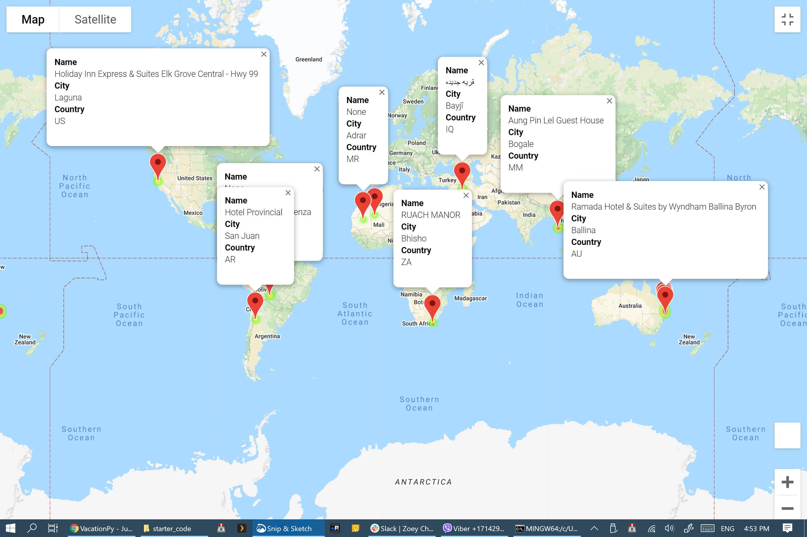

# python-api-challenge
~~I'm only about 2/5ths done...ish?~~

Woohoo! Done!

## Three Observable Trends (WeatherPy)

1. The further away from the equator (Latitude 0), the cooler the max temperature gets in both hemispheres. But you can tell that one hemisphere is the opposite season vs the other, as the minimum max temps are very different (below 0F for the north vs a little below 50F for the south)
2. The further away from the equator, the humidity rises in the northern hemisphere, but not the southern.
3. Distance from the equator doesn't seem to affect the level of cloudiness in either hemisphere.

## Heat map (VacationPy part 1)

## Hotel map (VacationPy part 2)
