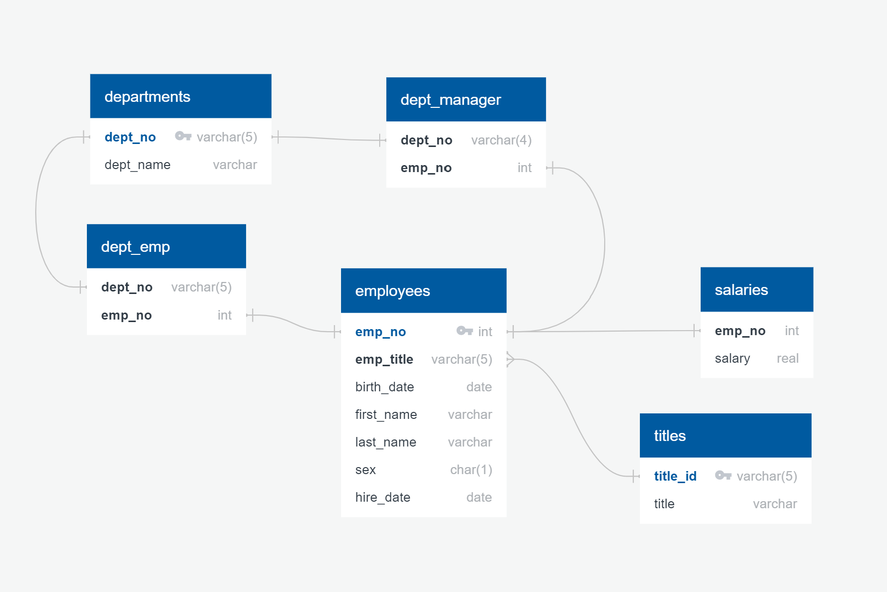

# 09-SQL Homework

-  is the picture of the ERD.
- 09-SQL Homework Queries.sql is the queries done.
- 09-SQL Homework Schema.sql is the schema that sets up the tables.
- 09-SQL Homework.ipynb is the Jupyter Notebook.

Epilogue: April Fool's!
